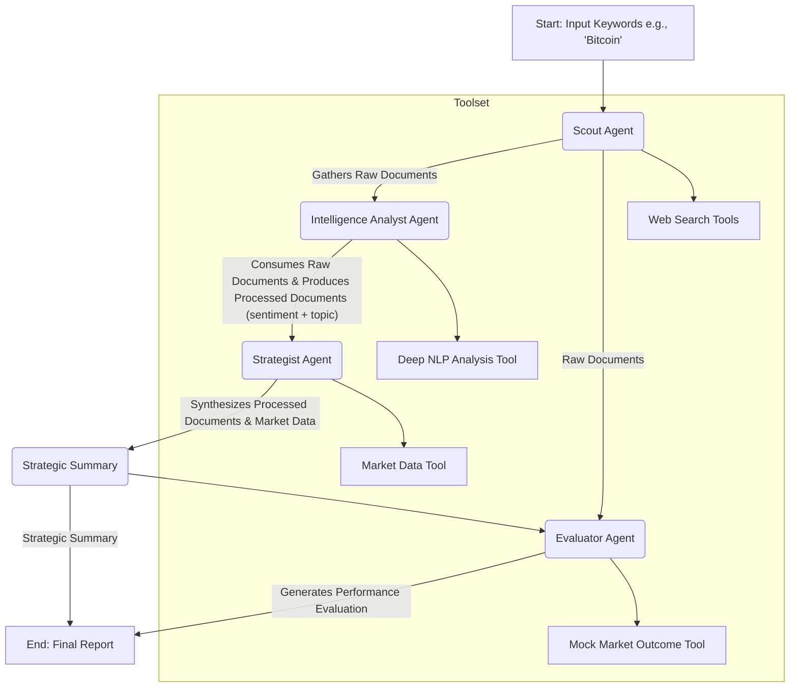

---

# CryptoSentinator v2 🤖📈

**A Multi-Agent Market Sentiment Analyzer powered by LangGraph**


CryptoSentinator is a proof-of-concept multi-agent system designed to gather, analyze, and correlate cryptocurrency sentiment from various online sources with market data. It leverages the power of LangGraph to orchestrate a team of specialized agents, each with a distinct role, to produce actionable market insights.

This project serves as a comprehensive example of building a stateful, multi-agent workflow using modern AI engineering principles.

## 📋 Table of Contents

- [About The Project](#about-the-project)
- [Key Features](#key-features)
- [System Architecture](#system-architecture)
- [Getting Started](#getting-started)
  - [Prerequisites](#prerequisites)
  - [Installation & Setup](#installation--setup)
- [Usage](#usage)
- [Project Structure](#project-structure)
- [Agents and Their Roles](#agents-and-their-roles)
- [Roadmap](#roadmap)
- [Contributing](#contributing)
- [License](#license)

## 🌟 About The Project

In the volatile world of cryptocurrency, market sentiment on social media and in the news can be a powerful indicator of future price movements. CryptoSentinator automates the process of monitoring this sentiment.

It uses a team of four AI agents:

1.  **The Scout:** It's responsible for sourcing raw textual data from various online platforms,including social media (X),forums (Reddit),and news outlets.
2.  **The Intelligence Analyst** This agent ingests the raw data from the Scout.Its core function is to apply advanced NLP models to not only assign a sentiment score but also to perform topic modeling. 
3.  **The Strategist** The "brains" of the operation.This agent synthesizes the structured data from the Analyst and current market price data.
4.  **The Evaluator** This unique agent provides a crucial feedback loop.It takes the Strategist's hypothesis and compares it against a simulated "ground truth" market outcome (logically derived from the initial raw data).
  
The entire workflow is orchestrated by **LangGraph**, which manages the state and ensures seamless data flow between the agents.

## ✨ Key Features

-   **Multi-Agent Architecture:** Demonstrates a clear separation of concerns with specialized agents for data gathering, processing, and analysis.
-   **LangGraph Orchestration:** Utilizes a stateful graph to manage the complex workflow, making the system robust and easy to debug.
-   **Extensible Toolset:** Integrates multiple custom tools for web searching (mock), NLP analysis, and market data retrieval (mock).
-   **LLM-Powered NLP:** Leverages the power of models like GPT-3.5-turbo for sophisticated sentiment analysis beyond simple keyword matching.
-   **Modular Design:** The project structure is organized into logical components (agents, tools, config), making it easy to extend or modify.

## 🏗️ System Architecture

The project operates as a stateful graph where each agent acts as a node. The `GraphState` object is passed and updated at each step, ensuring a shared understanding of the task's progress.

The flow is linear and can be visualized as follows:



## 🚀 Getting Started

Follow these instructions to get a local copy up and running.

### Prerequisites

-   Python 3.9+
-   An OpenAI API Key

### Installation & Setup

1.  **Clone the repository:**
    ```sh
    git clone <your-repository-url>
    cd cryptosentinator-v2
    ```

2.  **Create and activate a virtual environment:**
    ```sh
    # For macOS/Linux
    python3 -m venv .venv
    source .venv/bin/activate

    # For Windows
    python -m venv .venv
    .\.venv\Scripts\activate
    ```

3.  **Install the required dependencies:**
    ```sh
    pip install -r requirements.txt
    ```

4.  **Set up your API Key:**
    Create a file named `.env` in the root of the project directory `cryptosentinator-v2/` and add your API key:
    ```.env
     API_KEY="sk-YourSecret_ApiKey"
    ```

## 🏃 Usage

The `main` script is designed to be run as a module from the parent directory. This ensures all relative imports work correctly.
To start an analysis run, execute the following command from the project's root directory:
```sh
python -m cryptosentinator.main
```

The system will print the status of each agent as it runs. The final output consists of two main sections:

**Strategic Summary:**
```
{
  "cryptocurrency": "Bitcoin",
  "hypothesis": "Strong bullish sentiment driven by positive discussions on technology updates suggests a potential short-term price increase.",
  "confidence": "High",
  "reasoning": "The average sentiment is highly positive, and the dominant discussion topic is 'Technology Update'. This fundamental positivity, combined    with a recent stable price, points towards upward potential as the news disseminates.",
  "supporting_evidence": [
  "'Great news for #Bitcoin! To the moon! 🚀 #BitcoinIsTheFuture' (Topic: Price Speculation, Sentiment: 0.90)",
  "'Major financial news outlet reports on Bitcoin. Experts predict potential volatility...' (Topic: General Market Trend, Sentiment: 0.10)"
  ]
}

```

**Performance Evaluation:**
```
{
  {
  "cryptocurrency": "Bitcoin",
  "hypothesis_tested": "Strong bullish sentiment driven by positive discussions on technology updates suggests a potential short-term price increase.",
  "simulated_outcome": "Positive price movement (+5.72%)",
  "evaluation_result": "Correct",
  "evaluation_notes": "The hypothesis correctly predicted the direction of the simulated market movement."
}

```


## 📁 Project Structure

The codebase is organized to be modular and easy to navigate.

```
cryptosentinator/
├── __init__.py
├── main.py                     # Main script to run the system
├── agents/
│   ├── __init__.py
│   ├── scout_agent.py
│   ├── intelligence_analyst_agent.py
│   └── strategist_agent.py
    └── evaluator_agent.py
├── tools/
│   ├── __init__.py
│   ├── web_search_tools.py     # Mock X, Reddit, NewsAPI tools
│   ├── nlp_tools.py            # Sentiment & Entity Extraction
│   └── market_data_tools.py    # Mock Crypto Price API
├── graph_state.py              # Defines the shared state for LangGraph
├── config.py                   # Loads configuration (e.g., API keys)
└── requirements.txt            # Project dependencies
.env                            # (You create this) Stores secrets
```

## 🤖 Agents and Their Roles

-   `The Scout Agent`: This agent is the frontline data gatherer. It's responsible for sourcing raw textual data from various online platforms, including social media (X), forums (Reddit), and news outlets.
-   `The Intelligence Analyst Agent:`: This agent ingests the raw data from the Scout. Its core function is to apply advanced NLP models to not only assign a sentiment score but also to perform topic modeling. It classifies discussions into categories like "Technology Update," "Price Speculation," or "Regulation," adding critical context to the sentiment.
-   `The Strategist Agent:`: The "brains" of the operation. This agent synthesizes the structured data from the Analyst and current market price data. It uses a large language model (LLM) to form a coherent Strategic Hypothesis, complete with a confidence level, detailed reasoning, and supporting evidence.
-   `The Evaluator Agent: `: This unique agent provides a crucial feedback loop. It takes the Strategist's hypothesis and compares it against a simulated "ground truth" market outcome (logically derived from the initial raw data). This process generates an immediate performance score, allowing for rapid assessment of the system's analytical accuracy.
   
## 🗺️ Roadmap

This project is a foundation. Future enhancements could include:

-   [ ] **Real-time Data Integration:** Replace mock tools with real API clients for X, Reddit, NewsAPI, and a live crypto exchange like Binance or CoinGecko.
-   [ ] **Human-in-the-Loop:** Add a conditional node in the graph for human verification of critical insights before they are finalized.
-   [ ] **Advanced Correlation Models:** Move beyond simple checks to statistical models (e.g., Granger causality) or time-series analysis to find more robust correlations.
-   [ ] **Formal Evaluation Framework:** Implement a backtesting module to evaluate the profitability of signals generated by the system against historical data.
-   [ ] **Agent Communication Protocol (MCP):** If scaling to distributed services, define a formal JSON-based messaging schema for agents to communicate over a message queue (e.g., RabbitMQ).

## 🤝 Contributing

Contributions are what make the open-source community such an amazing place to learn, inspire, and create. Any contributions you make are **greatly appreciated**.

Please fork the repo and create a pull request. You can also simply open an issue with the tag "enhancement".

1.  Fork the Project
2.  Create your Feature Branch (`git checkout -b feature/AmazingFeature`)
3.  Commit your Changes (`git commit -m 'Add some AmazingFeature'`)
4.  Push to the Branch (`git push origin feature/AmazingFeature`)
5.  Open a Pull Request

## 📄 License

Distributed under the MIT License. See `LICENSE` for more information.
